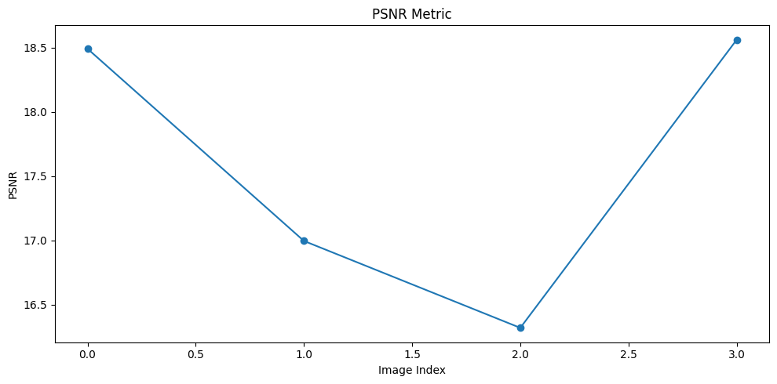
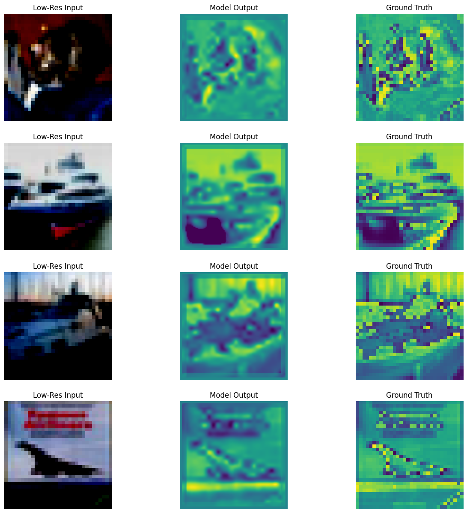
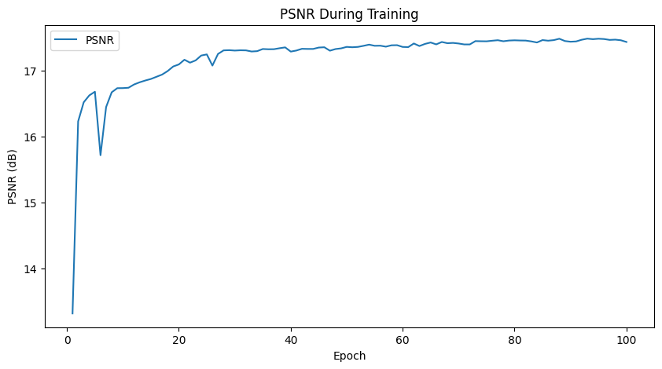
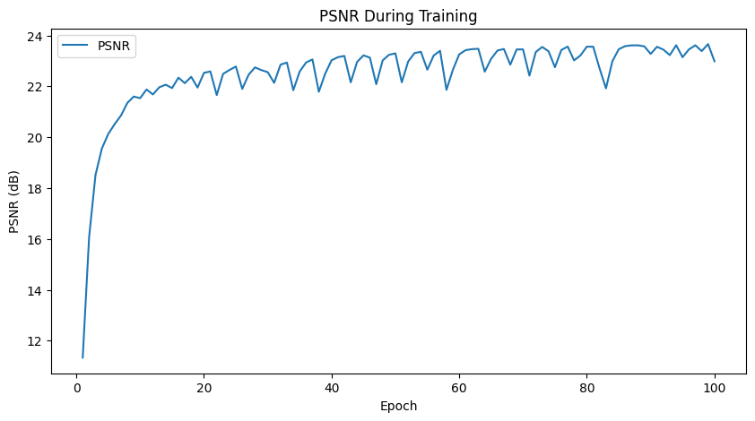

# Report of 1st paper

- this implimentation consists of a class CNN and CNN_color:

    ### CNN:

        1. in this class we have 3 convolutional layers, the 9-1-5 architecture mentioned in the paper 

        2. for the non-linear mapping we use ReLU  
        
        3. we can possibly experimnet with tanh. 

        4. and we use only one channel for the input "the Y channel" from the ycbcr, as paper showed that pretrianed y gave better results.

    ### CNN_color:

        1. This class also follows almost the same architeture as the CNN class the only difference is in the number of input channels

## Data used :

- i tried to expriment with the CIFAR dataset used in classes, just to see what kind of output would be given.

- its still left to trian on 91 images dataset (wichh have considerablely good resolution than the CIFAR dataset)

## evaluation metric used:
- PSNR 
    

## Inference:
- the output images were bad even though the loss converged to around 0.00792, the outputs were:

    

- for 91 subimage dataset, it gave a psnr of, with 9-1-5 arch and paddingof 6 in the middle layer for 100 epochs.
    

- for 91 subimage dataset, it gave a psnr of (with 9-3-1-5 arch and padding of kernel_size//2 for each layer for 100 epochs)

    